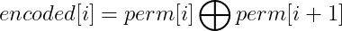

# LeetCode_Learning
创建本项目的是为了练习*LeetCode*题目并记录，以提升编程能力。

刷*LeetCode*时经常刷完过几天就忘了，所以每次刷完一题后对题目进行解法记录以加深印象。
## Array

## LinkList

## String

## Tree
[Simple 872. 叶子相似的树](https://leetcode-cn.com/problems/leaf-similar-trees) ：深度优先遍历得到两棵树的叶值序列后比较两个序列是否相等。

## Math
[Middle 1734. 解码异或后的排列](https://leetcode-cn.com/problems/decode-xored-permutation) ：
由  我们可以得到 

因此我们只需要获得perm任意一个位置的数，就可以得到原始的perm。perm[0]是最容易获得的，通过下述方法：

perm数组是由1~n的整数排列而成，由此我们可以计算 

又因为

由异或操作的自反性可以得到

