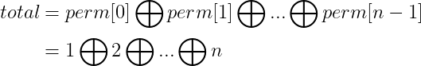

# LeetCode_Learning
创建本项目的是为了练习*LeetCode*题目并记录，以提升编程能力。

刷*LeetCode*时经常刷完过几天就忘了，所以每次刷完一题后对题目进行解法记录以加深印象。
## Array
[Middle 1442. 形成两个异或相等数组的三元组数目](https://leetcode-cn.com/problems/count-triplets-that-can-form-two-arrays-of-equal-xor/) ：
若 `a=b`，则有`S_{i}⊕ S_{j}=S_{j}⊕ S_{k+1}` 即`S_i=S_{k+1}`

## LinkList

## String
[Middle 12. 整数转罗马数字](https://leetcode-cn.com/problems/integer-to-roman)

## Tree
[Simple 872. 叶子相似的树](https://leetcode-cn.com/problems/leaf-similar-trees) ：
深度优先遍历得到两棵树的叶值序列后比较两个序列是否相等。

[Simple 993. 二叉树的堂兄弟节点](https://leetcode-cn.com/problems/cousins-in-binary-tree) ：深度优先搜索得到目标值的「深度」以及「父节点」两个参数即可。
## DP
[Hard 1269. 停在原地的方案数](https://leetcode-cn.com/problems/number-of-ways-to-stay-in-the-same-place-after-some-steps) :
运用动态规划 用 dp [i][j] 表示在 i 步操作之后，指针位于下标 j 的方案数，其中0≤i≤steps，j≤min(arrLen-1,steps)
每一步操作中，指针可以向左或向右移动 1 步，或者停在原地。因此，当 1≤i≤steps 时，状态 dp[i][j] 可以从 dp[i-1][j-1]、dp[i-1][j] 和 dp[i-1][j+1] 这三个状态转移得到。状态转移方程如下：

dp[i][j]=dp[i-1][j-1]+dp[i-1][j]+dp[i-1][j+1]

## Math
[Middle 1310. 子数组异或查询](https://leetcode-cn.com/problems/decode-xored-permutation) ：暴力破解方法也可以解决但容易超时，
可以先逐个计算前k个数字的异或操作存储在数组XOR，在计算Li 到 Ri 的值时，读取XOR第Li和Ri的值进行异或操作，
0~Li的数会因异或操作的自反性相互抵消，即可得到最终结果。

[Middle 1734. 解码异或后的排列](https://leetcode-cn.com/problems/decode-xored-permutation) ：
由  我们可以得到 

因此我们只需要获得perm任意一个位置的数，就可以得到原始的perm。perm[0]是最容易获得的，通过下述方法：

perm数组是由1~n的整数排列而成，由此我们可以计算 

又因为

由异或操作的自反性可以得到

## DP
[Hard 664. 奇怪的打印机](https://leetcode-cn.com/problems/strange-printer) 

